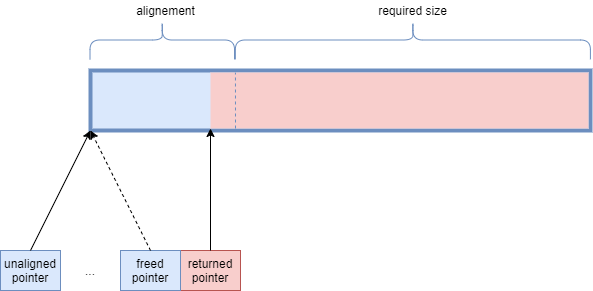

Fill the current report and commit it as any other file (be compact, a few lines per Section should be enough).

# At the end of the practical work

## What worked
#### 1. print_av_cores  
Run the program with `taskset -c [list-of-cores]` to bind the program to a specific list of CPU cores.

#### 2. print_moves  
First we must get the list of available cores, next we need a `std:map`. The map's keys are the available core ids, and the values are each core's appearance count as the process moves through cores.

#### 3. dot_with_move  
After each call to `dot` in the loop, the process's affinity mask is emptied out with `CPU_ZERO`, and filled with the next available core using `CPU_SET`.

## What did not work
#### 4. aligned_malloc (part 1)  

#### 5. aligned_malloc (part 2)  


<br/>

# Final status

## What works

#### 4. aligned_malloc (part 1)  
Let's assume the given pointer's address can (or has to be) be over-aligned (alignment larger(strict) than `alignof(std::max_align_t) = 8 or 16`). Starting at `128 bytes`, we shall divide the alignment's value by `2` until the remainder of the pointer's address division by the current alignment yields `0`.


#### 5. aligned_malloc (part 2)  
As indicated by the picture below, the steps for the `custom_aligned_alloc` function are listed below:  


1. Allocate more space than necessary: `alignement + required size` should suffice. Actually, we know that the first aligned block is located somewhere before `unaligned pointer's address + alignment`.

2. Find the first aligned block, we have two approaches:
    - The naïve approach is to increment the unaligned pointer until we find an address that is properly aligned. This is done using a loop: 
    ```
    ptr = reinterpret_cast<size_t>(unalignedPtr);  
    while (alignementOfPtr(reinterpret_cast<void *>(ptr)) != Alignment)  
        ptr += 1; 
    ```

    - The second technique is to perform binary arithmetic. We know that the last bits of `alignment-1` are all equal to 1 (since `alignment` is a power of 2). Before negating and using it in a **`bitwise and`** operation, we should add the `unaligned pointer's address` to `alignment`. This way, the returned value is an aligned address (since the last bits of `~(aliggment-1)` are all `0`) found between `unaligned pointer` and `unaligned pointer + alignment` (the returned value is lower than `unaligned pointer + alignment` because the **`and`** operation nullified its final bits).   
    In conclusion, the returned (aligned) pointer is:  
    ```
    ptr = (reinterpret_cast<size_t>(unalignedPtr) + size_t(Alignment) & ~size_t(Alignment-1));
    ```

3. Store the pointer to the larger unaligned block into an address close to the returned pointer `ptr` (at its left in our case). This way, it will be easier for the `custom_free` function to locate the block to free (the block that was created using `malloc`).     
```
*(reinterpret_cast<void **>(ptr) - sizeof(void **)) = unalignedPtr;
```

## What does not work
