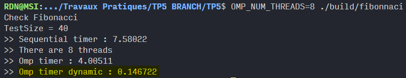

Fill the current report and commit it as any other file (be compact, a few lines per Section should be enough).

# At the end of the practical work

## What worked
1. simply parallel
2. dot
3. fibonacci

## What did not work
4. task based

# Final status

## What works
1. simply parallel
2. dot
3. fibonacci: I took the liberty of adding a dynamic programming version. It uses a C++ map in a top-down approach and produces better results:

4. task based

## What does not work
Nothing doesn't work
 